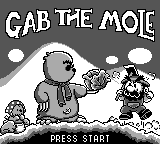

# GameBoyGame




Help Gab the mole escape a Game Boy island by beating 3 different minigames.

## About the Game

Gab wakes up with a headache and a problem: crabs have kidnapped him and trapped him on an island. The only way out is to explore the lobby, talk to the island's strange bros, and prove himself in their games.

GameBoyGame is built like a tiny retro adventure hub. Between challenges, you move through a 3x3 tile-based island, meet animated NPCs, follow short dialogue scenes, and track your best attempts on a lobby scoreboard.

## Gameplay

The game starts at a title screen, then moves into save selection and difficulty selection. Difficulty changes the scores required to progress through the story:

| Difficulty | Trap Memory | Tetris | Flappy Bird |
| --- | ---: | ---: | ---: |
| Easy | 100 | 1500 | 10 |
| Medium | 200 | 2000 | 20 |
| Hard | 600 | 3000 | 30 |

Once in the lobby, Gab can walk between island screens, talk to NPCs, and enter minigames through story dialogue. Winning enough points advances the dialogue, saves progress, and opens the next step toward escape.

### Minigames

**Trap Memory** asks you to remember where the safe tiles appeared. Safe zones are shown briefly, then hidden. Move Gab onto safety before the ground catches him. Each new round adds score, and the game tightens over time with faster rounds and fewer safe tiles.

**Tetris** is a compact 10x18 version with the original seven pieces, line clears, scoring, level progression, soft drop, rotation, and a next-piece preview.

**Flappy Bird** keeps the pressure simple: tap A to jump, pass pipe gaps, and keep flying. The score rises as pipes pass Gab's position. Every 5 pipes the level increases, and every 3 levels the pipes move one pixel per frame faster.

## Features

- Story-driven island lobby starring Gab the mole.
- Three playable minigames: Trap Memory, Tetris, and Flappy Bird.
- Difficulty-based progression thresholds.
- Save selection, new-save flow, and battery-backed save data.
- Best-score and current-run scoreboard in the lobby.
- NPC dialogue with typewriter-style text and small sound effects.
- Animated lobby player and NPC sprites.
- Screen fades, transition sounds, and map-to-map lobby movement.
- DMG-style Game Boy visuals built from 2bpp tile and sprite assets.

## Controls

| Scene | D-pad | A | B | Start | Select |
| --- | --- | --- | --- | --- | --- |
| Title screen | — | — | — | Go to save select | — |
| Save select | Move cursor | Confirm | — | — | — |
| Difficulty select | Move cursor | Confirm | — | Confirm | — |
| Dialogue | — | Advance / skip | Advance / skip | — | — |
| Lobby | Move Gab | Talk / interact | — | — | Save and return to menu |
| Trap Memory | Move Gab | — | — | — | — |
| Tetris | Move piece · ↓ soft-drops | Rotate right | Rotate left | — | Return to lobby |
| Flappy Bird | — | Jump | — | — | — |

## Screenshots / Demo

Promise I will put some screenshot, but the best way to see how it works, its to star it hihi.

## Development History

The changelog in [`docs/CHANGELOGS.md`](docs/CHANGELOGS.md) traces the project from a small Game Boy base into a multi-minigame island adventure.

- **1.0.0, 2026-04-17:** Project initialization, first screen display, input handling, update loop, and a modular foundation.
- **1.1.0 to 1.2.0:** Screen transitions, transition sound effects, character sprites, dialogue boxes, letter-by-letter text, and dialogue controls.
- **1.3.0 to 1.8.0:** Tetris grew from placeholder assets into a playable grid with pieces, movement, gravity, rotation, collision, and a visual HUD.
- **1.9.0 to 1.10.0:** The lobby expanded with more assets, collision, animated sprites, map transitions, portals, enemies, and support for multiple connected screens.
- **1.11.0 to 1.11.2:** Tetris gained scoring, line clears, levels, gravity scaling, game-over handling, next-piece preview, random piece spawning, and internal cleanup.
- **1.12.0:** A full start menu was added, along with VRAM clearing support for cleaner scene changes.
- **1.13.0 to 1.16.0:** Flappy Bird was implemented with pipes, random gaps, gravity, jump input, collision detection, and visual fixes.
- **1.14.0 and 1.18.0:** The lobby story became a real progression flow with NPC dialogue, lose/win branches, a scoreboard, center-room events, escape dialogue, and breathing NPC animations.
- **1.15.0:** Trap Memory gained round progression, safe-tile timing, score handling, level progression, and game-over detection.
- **1.17.0:** Save data was added for scores, lobby position, current map, dialogue state, and difficulty.
- **1.19.0 to 1.19.2:** Save selection, difficulty selection, documentation, Doxygen setup, and broad gameplay/UI fixes landed.
- **1.20.0, 2026-05-16:** Flappy Bird gained an on-screen score display, score increments when passing pipes, and difficulty scaling during longer runs.

Note: the changelog contains version entries dated both May 2026 and June 2026. The summary above follows the order written in the changelog.

## How to Play

1. Build the ROM with `make`, or use the existing `GabTheMole.gb` if it is already present.
2. Open `GabTheMole.gb` in a DMG-compatible Game Boy emulator.
3. Press **Start** on the title screen.
4. Choose **Continue** or **New Save**.
5. For a new save, choose **Easy**, **Medium**, or **Hard**.
6. Explore the lobby, talk to NPCs with **A**, and beat the minigames to help Gab escape.

Recommended emulator: `SameBoy` (MacOS) or `Retroarch Emulator` (with the preset core `Gambatte`)

## Installation / Build

This project builds with GBDK-2020's `lcc` compiler and `make`.

```sh
make
```

The Makefile defaults to `GBDK_HOME=/opt/gbdk`. If GBDK-2020 is installed elsewhere, override it:

```sh
GBDK_HOME="$HOME/gbdk" make
```

Useful commands:

```sh
make clean   # remove intermediate build files
make fclean  # remove intermediates and GabTheMole.gb
make re      # rebuild from scratch
make doc     # generate Doxygen documentation
```

For deeper technical details, see [`docs/TECH.tex`](docs/TECH.tex), [`docs/TECH.pdf`](docs/TECH.pdf), and [`docs/Doxyfile`](docs/Doxyfile).

## Project Structure

```text
.
|-- asset/              # C tile, sprite, font, dialogue, menu, lobby, and minigame assets
|-- docs/               # Technical documentation, Doxygen configuration, and changelog
|-- include/            # Public headers for core systems, scenes, lobby, and minigames
|-- src/                # C source code for the game loop, scenes, lobby, common systems, and minigames
|-- GabTheMole.gb             # Built Game Boy ROM, when present
|-- Makefile            # GBDK-2020 build and documentation targets
`-- README.md           # Project overview and player-facing guide
```

Key source areas:

- `src/main/`: program entry point and scene state machine.
- `src/common/`: dialogue, text rendering, transitions, save data, RNG, VRAM clearing, and utility helpers.
- `src/menu/`: title screen, save selection, and difficulty selection.
- `src/lobby/`: island lobby, player movement, map switching, NPC dialogue, lore progression, and scoreboard.
- `src/mg1/`: Trap Memory.
- `src/mg2/`: Tetris.
- `src/mg3/`: Flappy Bird.

## License

currently none